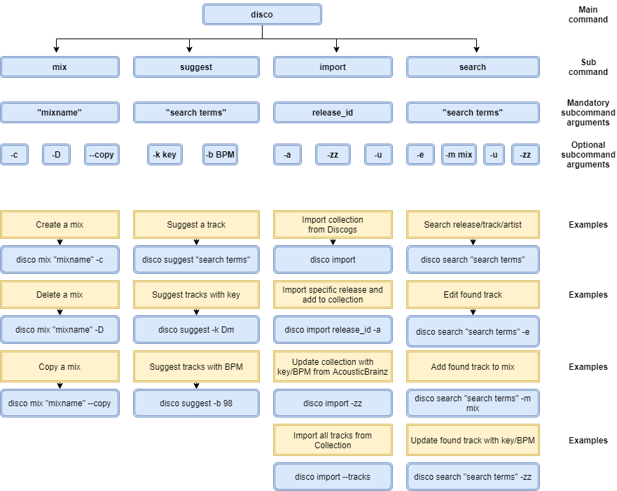

<!-- omit in toc -->
# DiscoDOS README
```
                _______  _______ ________
               /       \        /       /
              /  ___   /  ___  /  _____/
             /  /  /  /  /  /  \____  \
            /  /__/  /  /__/  _____/  /
D i s c o  /                /        /  - The geekiest DJ tool on the planet
          /_______/\_______/________/
```
DiscoDOS helps a DJ remember and analyze what they played in their sets, or what they could possibly play in the future. It's based on data pulled from a users [Discogs](https://www.discogs.com) record [collection](https://support.discogs.com/hc/en-us/articles/360007331534-How-Does-The-Collection-Feature-Work-). Tracks can be organized into playlists and mix-transitions rated. Additionally the collection can be linked to the online music information services [MusicBrainz](https://musicbrainz.org) and [AcousticBrainz](https://acousticbrainz.org), thus further information (like musical key and BPM) is made available to the user.

DiscoDOS primarily aims at the Vinyl DJ but features for "Hybrid-Vinyl-Digital-DJs" are **planned**:

- Linking the Discogs collection to DJ software (eg Pioneer's Rekordbox).
- DiscoDOS will then be able to answer questions like: "Could I play this set in a digital-only situation? Do I have all those records as files?".

Further feature plans include:

- built-in contribution possibilites to [AcousticBrainz](https://acousticbrainz.org) (a crowd source based acoustic information database), to help this useful resource grow.
- Syncing the database with a mobile-app. Have all your DiscoDOS information available when you need it - even when offline.

DiscoDOS currently is available as a command line tool only, though prototypes of a mobile and a desktop app exist already. Despite of what the name implies, it's just the look that is reminiscent of the 80s/90s operating system, its usability follows most standards of a typical [shell](https://en.wikipedia.org/wiki/Shell_(computing)#Unix-like_systems) utility you would find on a [UNIX-like operating system](https://en.wikipedia.org/wiki/Unix-like). It is aimed to support modern Linux, MacOS and Windows systems.

This should give you an idea on how it looks and feels (your screen is not broken, these animated gifs are very low quality to make them load quickly):


<!-- omit in toc -->
##### Viewing mix details, searching and adding track:

<!-- omit in toc -->
##### Updating track information from Discogs and MusicBrainz/AcousticBrainz:


- [Installation](#installation)
- [Importing your Discogs collection](#importing-your-discogs-collection)
- [Commands Chart](#commands-chart)
- [Basic Usage Tutorial](#basic-usage-tutorial)
- [Common Tasks](#common-tasks)
  - [I'm stuck in a mix](#im-stuck-in-a-mix)
  - [I'd like to quickly rate my transitions](#id-like-to-quickly-rate-my-transitions)
  - [I got a new record and want to quickly use it in DiscoDOS without re-importing everything](#i-got-a-new-record-and-want-to-quickly-use-it-in-discodos-without-re-importing-everything)
  - [I'd like to get as much information about my music as possible - in one go!](#id-like-to-get-as-much-information-about-my-music-as-possible---in-one-go)
  - [I'd like to use my DiscoBASE on multiple computers](#id-like-to-use-my-discobase-on-multiple-computers)
- [User's Manual](#users-manual)


## Installation

Please head over to the [INSTALLATION](INSTALLATION.md) document for step by step instructions on how to get DiscoDOS running on your machine.


## Importing your Discogs collection

To let DiscoDOS know about our Discogs record collection we have to import a subset of the available information to the local database (the so-called DiscoBASE).

`disco import`

## Commands Chart

Before you move on with the [Basic Usage Tutorial](#basic-usage-tutorial) have a look at the following picture. It shows how `disco` - The DiscoDOS' main command - is working. Usually a `disco` command is built from multiple words and options (-x and/or --something). The top half of the chart describes how the put those components together to create a working command. The bottom half shows some common usage examples.



## Basic Usage Tutorial

When importing is through, create a new mix:

`disco mix my_mix -c`

View your (empty) mix:

`disco mix my_mix`

Try adding one of your collection's tracks to the "mix" you just created.

`disco mix my_mix -a "Amon Tobin Killer Vanilla"`

If DiscoDOS realizes you are offline it will search in the local database only. Only online search understands track names, offline search doesn't, it needs artists and/or release names. Learn why, further below.

Be precise when asked for the track number on the record: A1 is not the same as A.

View your mix again, your track should be there. verbose view (-v) shows that track and artist names are still missing because DiscoDOS by default is minimalistic - the initial import command did not fetch this data yet:

`disco mix my_mix -v`

Add some more tracks!

Now get track artist/titles for all the tracks in the mix. If track numbers are not precise (eg A vs A1) data won't be found!

`disco mix my_mix -u`

Use the verbose mode to see all the details pulled from Discogs:

`disco mix my_mix -v`

Ask what more you could do with your mix and its tracks (short option would be -h):

`disco mix my_mix --help`

Edit details of the third track in your mix:

`disco mix my_mix -e 3`

There is also a bulk-edit option to edit specific fields of all tracks in the mix. Read about it in the command reference section of [The mix command](#The-mix-command)

Get additional data about your mix's tracks from MusicBrainz and AcousticBrainz (key, BPM, links):

`disco mix my_mix -zz`

Read more about the *Brainz update process here: [The import command](#The-import-command)

## Common Tasks


### I'm stuck in a mix

You're in the process of compiling a mix for a gig. You just played this one tune that was really fitting well, but now you're stuck and don't know how to move on. You try out different records, nothing seems to work.

DiscoDOS can tell you in what combinations you ever played this tune in the past:

`disco suggest "search terms to find the tune"`

Another option would be to let it show you a pool of tracks sharing similiar key and BPM:

`disco suggest -k Am -b 123`

_**Note: If your tune(s) do not have key and BPM data yet, let them "match" with MusicBrainz first, by using the [update from brainz](#search-action-update-from-brainz) search action**_

### I'd like to quickly rate my transitions

You are listening to a recording of a mix you have already documented into DiscoDOS and now would like to quickly rate your transitions, so you and DiscoDOS can learn from it.

Use the bulk-edit function to change specific fields of your mix's tracks:

`disco mix "the mix name" -b trans_rating,trans_notes`

Learn more about this function in the [mix command section](#the-mix-command).

_**Note: Currently DiscoDOS rating analysis system is not finished. This will be coming in future version. As a preparations for this feature, you only are allowed to put these character combinations into the trans_rating field: ++, +, ~, -, --**_


### I got a new record and want to quickly use it in DiscoDOS without re-importing everything

Search for the record on discogs.com. Get the ID from the release pages URL (eg. https://discogs.com/release/123456) and import it:

`disco import 123456`

Get artist/title for each track

`disco search 123456 -u`

Get key and BPM from MusicBrainz/AcousticBrainz:

`disco search 123456 -zz`

_**Note: Certainly you can always find a tune in your collection by using search terms. You don't have to use the release ID. We use it here because we have it at hand already**_

A regular search command and starting *Brainz matching:

`disco search "new release new tune" -zz`

There is another convenient way when you are in the process of writing down a mix, and realize you can't find the release because you didn't add it to the collection yet: Use the -a option of the mix subcommand. Then, instead of searching for a text-term, we hand over a Discogs release ID. DiscoDOS will look for this exact release ID and add it to your Discogs collection as well as to the local DiscoBASE. As expected with the `mix -a` commmand, the interactively selected track will be added to your mix too:

`disco mix fat_mix -a 123456`
### I'd like to get as much information about my music as possible - in one go!

As you've probably learned already, DiscoDOS doesn't import all information about a record collection at once but rather "on user request". Eg. single tracks or whole mixes can be asked to be filled in with additional data from Discogs or AcousticBrainz. When dealing with record collections containing hundreds or even thousands of records, obviously working through all of them via the APIs of online information services takes a lot of time, but certainly DiscoDOS can be asked to do it:

To make a full import of your whole record collection from Discogs (all releases INCLUDING all tracks on them) execute:

`disco import --tracks`

_**Note: This command can also be used for an initial import (you just started using DiscoDOS - DiscoBASE is still empty).**_

_**1000 records including a total of 3000 tracks complete in about 20 minutes**_

To get additional data from MusicBrainz and AcousticBrainz (key, BPM, weblinks to release- and recordingpages), execute:

`disco import --zz`

_**Note: This command requires the import-tracks command above, being completed already.**_

_**This process will take hours and hours, depending on the size of your collection**_

Read more on "*Brainz matching and importing" and it's performance in the [the import command chapter](#The-import-command). You will also learn how the process could be resumed if for some reason the computer had to be switched off or the connection broke away.

Here's a trick to execute both commands one after the other. We use the "command concatination" features of our shell:

On Windows, do:

`disco import --tracks  &  disco import -zz`

on macOS or Linux it's:

`disco import --tracks  &&  disco import -zz`

Leave this running "overnight" - You will see a final summary after each of the commands completes, telling you the exact time it was running and how much information was processed and imported. If you'd like to help improve this manual, copy/paste your stats into a [Github issue](https://github.com/JOJ0/discodos/issues), it would help me a lot to state more accurate estimates here.

### I'd like to use my DiscoBASE on multiple computers

DiscoDOS includes a built-in backup and restore feature that can also be used to sync a DiscoBASE between multiple computers.

We need a place to store our discobase.db file online. Currently there are two options:
- Dropbox
- A folder on a webserver

This section will describe how to use Dropbox only, find the webserver option documented here: FIXME

To allow DiscoDOS access to your Dropbox account you need an access token. To obtain it follow the steps in chapter [Configure Dropbox Access for _discosync_](INSTALLATION.md#configure-dropbox-access-for-discosync), then come back here.

To backup your DiscoBASE, execute:

`discosync --backup` or in short `discosync -b`

To restore it on another computer, execute:

`discosync --restore` or in short `discosync -r`

_**Note: Certainly you can use this feature to backup and restore your DiscoBASE on one computer only. The commands are the same**_


## User's Manual

Even more details on what DiscoDOS can do is found in the [DiscoDOS User's Manual](MANUAL.md). Consider the README page (you are on currently) as a quickstart guide and consult the User's Manual for advanced usage concepts. You will also find some background info on how things work and why.
