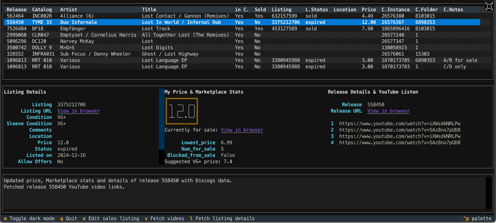

# README
```
        _______  _______ ________
 D i s c o     \        /       /
      /  ___   /  ___  /  _____/
     /  /  /  /  /  /  \____  \
    /  /__/  /  /__/  _____/  /
   /                /      record collector's toolbox
  /_______/\_______/________/
```
DiscoDOS is a set of command line tools for DJ's and record collectors.

- It's based on data fetched from a user's [Discogs](https://www.discogs.com) record [collection](https://support.discogs.com/hc/en-us/articles/360007331534-How-Does-The-Collection-Feature-Work-) and [Marketplace inventory](https://support.discogs.com/hc/en-us/categories/360000845253-Selling-on-Discogs).
- [List records for sale](https://discodos.readthedocs.io/en/latest/MANUAL.html#the-sell-command) on the Discogs Marketplace.
- [Edit Marketplace listings](https://discodos.readthedocs.io/en/latest/MANUAL.html#the-ls-tui-command) in a self-explanatory [_TUI_ interface](https://discodos.readthedocs.io/en/latest/MANUAL.html#the-ls-tui-command).
- Metadata of DJ sets can be tracked and analyzed to feed a simple ["suggestion" mechanism](https://discodos.readthedocs.io/en/latest/MANUAL.html#the-suggest-command).
- [Organize tracks into playlists](https://discodos.readthedocs.io/en/latest/MANUAL.html#the-mix-command) and rate mix-transitions.
- Link the collection to [MusicBrainz](https://musicbrainz.org) and [AcousticBrainz](https://acousticbrainz.org), to provide key and BPM data of tracks. These features are deprecated but still work partly - [read more about it here](https://discodos.readthedocs.io/en/latest/MANUAL.html#acousticbrainz-support-is-deprecated).

DiscoDOS is a command line tool, though [parts of it provide a TUI - a _text user interface_](https://discodos.readthedocs.io/en/latest/MANUAL.html#the-ls-tui-command). DiscoDOS is written in Python and runs on Linux, macOS and Windows.

### Viewing Marketplace stats, editing listings, fetching videos



### Selling a record


### Viewing mix details, searching and adding track


### Updating track information from Discogs and MusicBrainz/AcousticBrainz


_The latter two videos are slightly outdated. DiscoDOS' main command now is called `dsc` and AcousticBrainz as an actual website not existing anymore (API-only, which DiscoDOS makes use of)._

### Video Tutorials

- [How to use DiscoDOS #1 - Mixes, Suggestions, Collection, AcousticBrainz](https://www.youtube.com/watch?v=c9lqKuGSCVk&list=PLcHqk0rpp8bprmYlaXdrs6pbOpPoJwW-T)
- [How to use DiscoDOS #2 - Finding key & BPM compatible tracks](https://www.youtube.com/watch?v=agp9OrYC66I&list=PLcHqk0rpp8bprmYlaXdrs6pbOpPoJwW-T&index=3)
- [How to use DiscoDOS #3 - Fetch key & BPM from AcousticBrainz](https://www.youtube.com/watch?v=4lungDgdJ2w&list=PLcHqk0rpp8bprmYlaXdrs6pbOpPoJwW-T&index=4)

### Docs

- [Quickstart Guide](https://discodos.readthedocs.io/en/latest/QUICKSTART.html)
- [Setup Guide](https://discodos.readthedocs.io/en/latest/INSTALLATION.html)
- [User's Manual](https://discodos.readthedocs.io/en/latest/MANUAL.html)

### Website

- [discodos.jojotodos.net](https://discodos.jojotodos.net)