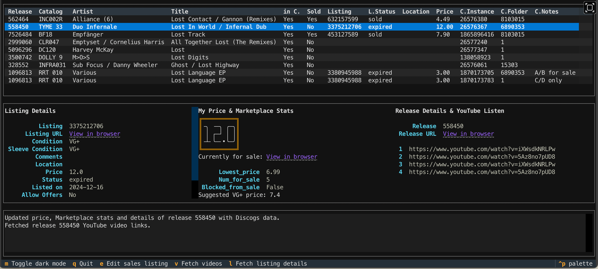

<!-- omit in toc -->
# Manual

This document contains in-detail explanations about a lot but not all you can do with DiscoDOS.

## Command line tools primer

In case you don't use UNIX-like command line tools much: `dsc` is designed as such, thus each option has a short form and a long form. For example the help output of the `dsc` main command can be requested two ways:

`dsc --help` or `dsc -h`

another example:

`dsc suggest --bpm 123` is the same as `dsc suggest -b 123`

Throughout this section, mostly the short forms are used, but sometimes the long forms too because they're just more self-explanatory.

Also a common concept with command line tools is that "optional arguments" (the ones starting with a dash) can be put before or after "positional arguments (in this case the mix_name):

`dsc mix new_mix -c` is the same as `dsc mix -c new_mix`

Also the order of "optional arguments" is freely choosable most of the time:

`dsc search "search terms" -m new_mix -t A2`

is the same as

`dsc search "search terms" -t A2 -m new_mix `


## *dsc* - the main command

DiscoDOS' main command is `dsc`, to view it's help:

`dsc -h`

It contains several subcommands or further command groups.

To execute a subcommand you would eg type:

`dsc search ...`

Each subcommand has its own built-in help output:

``` bash
dsc mix -h
dsc suggest -h
dsc import -h
dsc import basic -h
dsc import tracks -h
dsc import release -h
dsc import sales -h
dsc import listing -h
dsc clean -h
dsc clean collection -h
dsc clean sales -h
dsc search -h
dsc sell -h
dsc stats -h
dsc ls -h
dsc links -h
```

The following chapters describe some features of the respective commands, an exhaustive list is found in the [Commands Reference](index_commands_reference.rst)

### Global switches

The general behaviour of `dsc` can be altered by some "optional arguments":

Enable INFO logging output or DEBUG logging output on your terminal (usually only relevant if you're investigating errors, are a developer or just want to know what DiscoDOS is doing under the hood):

enable INFO logging (-v) or DEBUG logging (-vv) output:

`dsc -v ...` or `dsc -vv ...`

DiscoDOS checks if it's online automatically but can be forced to stay in offline mode:

`dsc -o ...`


## The *dsc* subcommands

Each subcommand has its typical purpose but some actions can be executed from within other subcommands as well.

### Abbreviations

`dsc` commmands can be abbreviated. For example to issue `dsc import release` use `dsc imp rel` or even `dsc i r`.

### The `import` command group

#### Importing releases / collection items

You can update your DiscoBASE from your Discogs collection at any time, if data is already existing, it will be updated.
Due to the Discogs API being not the fastest, it takes some time though. There are other ways for adding single releases to Discogs AND to your DiscoBASE simultaneously.

_**Note: This imports all your releases, but not the tracks on them**_

`dsc import basic`

A quicker alternative, if you are about to import just a couple of new releases is to use the -a option. The release will be added to your Discogs collection _and_ also imported to DiscoBASE. Pass the release ID or the URL of the release (eg https://www.discogs.com/release/123456) .

_**Note: You don't have to click "Add to Collection" on discogs.com, DiscoDOS does this for you**_

`dsc import release -a 123456`

To add a release to DiscoBASE **only** (because it's been already added to your collection via the Discogs web interface), just use the import command with a release ID or URL attached: 

`dsc import release 123456`

To remove a release:

`dsc import release -d 123456`


#### Importing track details

To import all releases including all tracks in your collection use the tracks subcommand. 1000 records take about 20-30 minutes to import:

`dsc import tracks`

To add additional data to your tracks from MusicBrainz/AcousticBrainz (key, BPM, links) use the brain subcommand. Your releases will then be "matched" one-by-one with MusicBrainz - this is not the easiest task for DiscoDOS, several things have to be "tried" to get it right. Differences in spelling/wording of catalog number, artists, title, track numbers, track names in MusicBrainz compared to Discogs are the main reason why it takes that long:

_**Note: This process will take hours. Best you let it run "overnight"**_

`dsc import brainz`

A slightly quicker but less effective method is using the --quick option:

`dsc import brainz -q`

Also remember that it's unlikely that MusicBrainz even *has* an entry for each of your records. Discogs still *is* the most complete music database on earth compared to others. Most definitely when it comes to Vinyl records.

Also note that often it happens that a MusicBrainz track _can_ be "matched" but AcousticBrainz does not have an entry for it yet.

If for some reason you can't complete the run (connection problems, having to switch off your computer, ...) you can resume the process at a later time. DiscoDOS spits out regularly how many tracks have been matched already and how many are to be done. This will resume the matching at track number 2500 in your collection:

`dsc import brainz --resume 2500`

The "*Brainz match process" currently adds the following data to releases:

- Release MusicBrainz ID (Release MBID)
- weblink to the MusicBrainz release

and the following data to tracks (if available):

- BPM
- key
- chords key
- Recording MusicBrainz ID (Recording MBID)
- weblink to the MusicBrainz recording (A track is called a recording in "MusicBrainz speak")
- weblink to the AcousticBrainz recording (AcousticBrainz uses the same recording MBID as MusicBrainz - this is the link between the two services!)


#### Importing Marketplace inventory items

The whole inventory:

`dsc import sales`

Single sales listings:

`dsc import listing <listing_id>`


### The `search` command

#### Online search

As the name implies, this command searches in your collection. **By default it uses the Discogs API to search for release names, track names, track artists, catalog numbers and labels.**, and then compares those results with your local collection data in the DiscoBASE. This is an efficient way, that makes use of the versatile Discogs search without having to reinvent the wheel.

Let's try a search:

`dsc search "Amon Tobin"`

_**Note: The online search is designed "first match"**_

So this gives you the first found "Amon Tobin" album in your collection only. You have to be more specific to find a particular album:

`dsc search "Amon Tobin Foley Room"`

Since DiscoDOS 3.0 quoting of search terms is not required anymore. This works too:

`dsc search Amon Tobin Foley Room`


#### Offline search

If you currently are not connected to the internet or you enable "offline mode" the *search* command behaves differently: Your search terms are only applied against the *release title* and the *release artist(s)*, but not the *track name*. There is a reason for this: DiscoDOS by default does not import *track name*. Even though certainly you have the option to import *track names*, the search does not rely on this. Maybe this behaviour changes in future releases. It was a design decision in the first DiscoDOS prototype versions.

_**Note: The offline search shows a "list of matching items"**_

#### `search` command actions

To "do" something with a track on an album you need to append an "optional argument" to the command. The following actions can be applied to the found track:

- "edit track" (option -e)
- "add track to mix" (option -m)
- "update from Discogs" (option -u)
- "update from *Brainz" (option -z)

#### `search` action "edit track"

To edit the track's details in the DiscoBASE you use:

`dsc search "Amon Tobin Foley Room" -e`

You will see the album's contents and be asked to put in a track number (eg A1, C2, ...). Then you will be walked through all the "editable" fields. It's pretty self-explanatory, but read the hints on the screen.

If you know which track number you'd like to edit already, provide it on the command line directly. You won't be asked for the track number then:

`dsc search "Amon Tobin Foley Room" -e -t B2`

#### `search` action "add track to mix"

The track you select on the found release will be added to the given mix-name:

`dsc search "Amon Tobin Foley Room" -m my_mix`

If your mix's name contains spaces, wrap it in double quotes:

`dsc search "Amon Tobin Foley Room" -m "my longish mix name"`

As a shortcut you can always just use the mix's ID number (you see the numbers in the output of the `dsc mix` command):

`dsc search "Amon Tobin Foley Room" -m 27`

Certainly also here you can provide the track number on the command line already. So to add track A2 on "Foley Room" to mix number 27:

`dsc search "Amon Tobin Foley Room" -m 27 -t A2`

#### `search` action "update from Discogs"

As already mentioned already, DiscoDOS is minimalistic by default. The default import command `dsc import` just gets exactly this data from Discogs: release IDs, release titles, release artists, catalog numbers. To put track names of a particular track into the DiscoBASE as well you'd use:

`dsc search "Amon Tobin Foley Room" -u`

Again, combination with -t is possible:

`dsc search "Amon Tobin Foley Room" -u t A2`

To make **all** *track names* on **all** releases in your collection available offline, use:

`dsc search all -u`

_**Note: This is exactly the same as using `dsc import --tracks` or in short: `dsc import -u`.**_

Read more on importing release and track information in the [import command section](#the-import-command-group)

#### `search` action "update from *Brainz"

To extend a tracks information with data from MusicBrainz and AcousticBrainz:

_**Note: To make this work, the track must have been updated from Discogs with track names already. See [update from Discogs](#search-action-update-from-discogs) action above.**_

`dsc search "Amon Tobin Foley Room" -z`

If the track couldn't be matched with the regular match command, try the "detailed match" command (takes more time, but chances on finding a match are higher):

`dsc search "Amon Tobin Foley Room" -zz`

or as usual with track name already in the command:

`dsc search "Amon Tobin Foley Room" -zz -t A2`

If you've already imported all your *track's names* to the DiscoBASE, you could even try to update **all** tracks with MusicBrainz information (takes a couple of hours):

```
dsc search all -z
dsc search all -zz
```

Read more on the performance of the *Brainz match process and what exactely it imports in the [import command section](#importing-track-details)


### The `ls` TUI command

Lists releases in the DiscoBASE and allows manipulating them in a self-explanatory _text user interface_ built using the [Textual framework](https://textual.textualize.io). Its current main purpose is to edit details of already listed records on the Discogs Marketplace.

Supports [Key/Value Search](#keyvalue-search).



For example to display and allow editing of all Marketplace listings currently in `draft` status, use:

`dsc ls status=draft`

A list of _command keys_ will be available in the footer of the  _TUI_ interface! Some of the most useful one's are:

- `e` -> Edit sales listing
- `v` -> Display YouTube video hyperlinks
- `return` -> Fetch Marketplace stats and "Discogs suggested prices"

The `ls` command can fall back to a classic CLI version using the `-x/--no-tui` flag. Manipulating entries using this view-mode is not possible:

`dsc -x ls status=forsale"`

_**Note: `-x/--no-tui` is a global option, and must be stated right after the main command `dsc`. In future DiscoDOS releases _other_ parts of DiscoDOS might have a _TUI_ version as well.**_

#### `ls --extra` - an alternative view-mode

There are two view-modes. By default the `ls` command assumes records are in the collection and potentially could be listed for sale. A sort of "combined" view. The collection item is enriched with the listing ID, the status of the listing and the price:

`dsc ls status=expired artist=duo`


When launched with the `--extra` option, the sales listing is displayed in an "extra" line. Also it's now obvious that a sales listing does not have a collection item instance ID, collection folder and collection notes set. Whereas the bottom line clearly identifies as being the actual collection item since it has set all these values.

`dsc ls --extra status=expired artist=duo`


The inital design of `dsc ls` was based on the fact that Discogs user collection items and Discogs Marketplace listings, at least as discogs.com is designed, do not really have a connection. DiscoDOS assumes that a user wants to sell parts of their collection, thus the usual case is that one copy of a record is in the collection and that same one potentially is for sale.

To get a view that respects how data is actually saved in DiscoDOS (and on Discogs) the alternative `dsc ls --extra` view was invented - a sales listing and a collection item are two different things.

In case multiple copies of a record are in the collection, AND that release is for sale too, `--extra` would correctly view three entries:

`dsc ls --extra title="mistical dub"`


There is one caveat with this design: A default `ls` view displays listing ID, status and price on BOTH collection items - it does not know which of those two items is the one being listed for sale, because again, in reality there is no connection between them:

`dsc ls title="mistical dub"`


The `--extra` option can also be stated as `-e`, `--all` or `-a`.

_A final note on collection folders being displayed as ID's. Showing folder names is in the queue for a future DiscoDOS release. Maybe even with the ability to move collection items between folders. This on the other hand requires an addition to the underlying library `python3-discogs-client`. Once that is implemented there, and the developers' time permits, work on `dsc ls` will be continued._


### The `sell` command

Guides your through the process of selling a record. It suggests prices, displays a lot of information supposed to help you with your decisions - YouTube video links, existing Marketplaces listings of the record, the "Discogs suggested price" for the condition we choose, as well as (hardcoded) for "M", "NM", "VG+" conditions.

Hardcoded default for record condition is "VG+". To override use the `-c/--condition` option. Sleeve condition will always be prompted for interactively. To override use `-s/--sleeve-condition`. Another hardcoded default is the status of a new listing. It will be set to `draft`. To override use the `-a/--status` option.

For example to list an Amon Tobin record for sale with a condition of `VG+` (the default) and a sleeve condition of `NM` while still being prompted to accept or alter a price suggestion:

`dsc sell -a forsale -s NM amon tobin foley room`

_**Note: The `sell` command uses the same search mechanisms as the [search](#online-search) command.**_


### The `mix` command

A mix is basically just a list of tracks in a specific order, a playlist, a track pool, you name it.

Create a mix. You will be asked to put in general info about the mix (venue, last played date). Make sure the played date is in the format YYYY-MM-DD:

`dsc mix my_mix -c`

Delete a mix (yes, it's a capital D):

`dsc mix my_mix -D`

Copy a mix. You will be asked for the name of the copy. (Note: --copy doesn't have a short form option):

`dsc mix my_mix --copy`

Edit general mix info (venue, played date):

`dsc mix my_mix -E`

Add a track to a mix. You will be asked for the track number on the found release. Note: Tracks can be added using the [search command](#search-action-add-track-to-mix) as well:

`dsc mix my_mix -a "search terms"`

To add the track at a specific position in the mix, rather than at the end:

`dsc mix my_mix -a "search terms" -p 3`

Edit details or 3rd track in the mix (key, key_notes, BPM, transition rating, transition notes, track notes, position in the mix, track number on the record, custom MusicBrainz recording ID):

`dsc mix my_mix -e 3`

Delete 3rd track in the mix:

`dsc mix my_mix -d 3`

Bulk-edit selected fields of all tracks in a mix. You can cancel editing without data loss by pressing ctrl-c. Data is saved after each track.

`dsc mix my_mix -b trans_rating,bpm,key`

Available field names: *key,bpm,track_no,track_pos,key_notes,trans_rating,trans_notes,notes,m_rec_id_override* (_**Make sure your field list has only commas and no spaces in between!**_)

To start bulk-editing at a specific track position rather than at track 1:

`dsc mix my_mix -b trans_rating,bpm,key -p 3`

Get track names for whole mix from Discogs:

`dsc mix my_mix -u`

Start getting track names at position 3 in the mix, rather than at track 1:

`dsc mix my_mix -u -p 3`

Get additional track info for whole mix from MusicBrainz/AcousticBrainz (key, bpm, links):

`dsc mix my_mix -z`

Start getting MusicBrainz/AcousticBrainz info at position 3 in the mix, rather than at track 1:

`dsc mix my_mix -z -p 3`

Run a "detailed *Brainz match" (more likely to find matches but significantly slower)

`dsc mix my_mix -zz`

Get track names for _all_ tracks in _all_ mixes from Discogs:

`dsc mix -u`

Get MusicBrainz/AcousticBrainz info for _all_ tracks in _all_ mixes from Discogs. Do a "detailed *Brainz match" run:

`dsc mix -zz`

*Brainz matching is a tedious process for DiscoDOS (more details on this [here](#the-import-command-group)), if you have to switch off your computer for any reason while it's running, cancel the process using ctrl-c and it later at the given position (in this example track number 150 in the list of *all* tracks in *all* mixes):

`dsc mix -zz --resume 150`


### The `suggest` command

The suggest command helps a DJ find possible track combinations by reporting how a track has been used in the past or by finding tracks fitting with certain criteria. Fun fact: These features were the initial ideas for writing a program like DiscoDOS.

Find out in which combinations a track ever was played by looking through all your mixes. This command does a regular search in the collection, spits out a "first match" release and asks for a track number on the release. The presented output shows "snippets" of mixes, telling you exactly which tracks you have used _before_ and _after_ the selected track:

`dsc suggest "amon tobin kitchen sink"`


Show all tracks in collection _**containing**_ "Dm" (D minor) either in the user-key or AcousticBrainz keys fields (key, chords_key).

`dsc suggest -k Dm`

DiscoDOS allows a user to put in more than one key in the user-key field. Information like "Am/Dm/Gm" is allowed. To find this information the following search could be used. Note the _wildcard_ character being the percent sign (%):

`dsc suggest -k "Am%Gm"`

Certainly the a record with "Am/Dm/Gm" in the user-key field would also be found by a simple search like this:

`dsc suggest -k Am`


Find all tracks in collection with a BPM _**around**_ 120. The pitchrange of a typical turntable is taken into account. Currently this is hardcoded to +/-6 percent (this will be a user-configurable value in future DiscoDOS versions):

`dsc suggest -b 120`

key and BPM search can be combined:

`dsc suggest -k Dm -b 120`


**Note: The key and BPM suggest commands require sufficient information in the DiscoBASE. Either in the user-editable key and BPM fields or in the AcousticBrainz fields**

Read how to automatically fill these fields with data from AcousticBrainz in the section about the [`import brainz` command](#the-import-command-group).


### The `links` command

Displays all "links to online services" that are available in the DiscoBASE. Supports [Key/Value Search](#keyvalue-search).

For example to display a list of releases listed for sale, including hyperlinks to Discogs release, Discogs Marketplace listing details  and MusicBrainz album, try:

`dsc links status=forsale`

...You'll get a very long list....
...

A slightly shorter example including expected output: All Amon Tobin release with a catalog number including characters "zen" (the usual Ninja Tune label's catalog number prefix):

```
$ dsc links artist=amon cat=zen

+----------+----------------------------------------------------------------------+
| CatNo    | Release: Artist - Title - Links                                      |
+==========+======================================================================+
| zen 1253 | Amon Tobin - Chomp Samba                                             |
|          | https://musicbrainz.org/release/c45e6bd6-de1c-48e5-a263-b89e063c0656 |
|          | https://discogs.com/release/31010                                    |
+----------+----------------------------------------------------------------------+
| ZEN 121  | Amon Tobin - Foley Room                                              |
|          | https://musicbrainz.org/release/1ab1c536-1f09-4761-ba49-4a25bcbcbf59 |
|          | https://discogs.com/release/919698                                   |
+----------+----------------------------------------------------------------------+
| ZEN 70   | Amon Tobin - Out From Out Where                                      |
|          | https://musicbrainz.org/release/599f40b6-65cf-4427-b77b-acc47f15e9a2 |
|          | https://discogs.com/release/69092                                    |
+----------+----------------------------------------------------------------------+
```


### The `stats` command

Displays interesting statistics about your DiscoBASE data.

`dsc stats`


### The `clean` command group

Since data can still be manipulated on the Discogs web interfaces, DiscoDOS might not always be "the single source of truth".

Compares collection items in the DiscoBASE with the actual Discogs collection and **mark as orphaned locally** if they were removed via the web interface:

`dsc clean collection`

**Note: Technically this affects the DiscoBASE 'release' and 'collection' tables.**

Compares collection items in the DiscoBASE with the actual Discogs Marketplace inventory and **deletes them locally** if they were removed via the web interface:

`dsc clean sales`

**Note: Technically this affects the DiscoBASE 'sales' table.**


## Key/Value Search

The `ls` command as well as other parts of DiscoDOS support a minimalistic key-value search mechanism. Any available DiscoBASE field in the releases and sales tables can be used with the caveat that one must know how they are literally called in the database. Therefore, the most common ones have easy to remember abbreviations:

- `cat` -> catalog number
- `id` -> release ID
- `artist` release artist
- `title` -> release title
- `label` -> release label
- `listing` -> Marketplace listing ID
- `stats` -> Marketplace listing status (forsale, draft, expired)
- `sold` -> A [flag marking releases "as sold" in the DiscoBASE](#there-are-several-ways-a-record-will-be-auto-marked-as-sold).
- `location` -> Marketplace listing location comments field
- `price` -> The price of a marketplace listing

The syntax is basic, `fieldname=value`, will return any releases where fieldname _**contains**_ the string `value`

Have a look at the [`dsc links` docs](#the-links-command) to find some example queries.


## Technicalities, DiscoBASE design, Workflow decisions


### The _collection_ table vs. the _release_ table

DiscoDOS prior to version 3.0 only used a single database table to store information
about a user's records - the _release_ table. It was assumed that any record is only owned once. DiscoDOS 3.0 changes this behaviour and saves it separately to a _collection_ table, hence multiple instances of a record are allowed to be in a DiscoDOS collection.

_**Note: This new collection data consists of Information about folders, date added to collection, ratings and notes. Not everything is already editable/viewable in DiscoDOS, but some....**_


### There are several ways a record will be auto-marked as _sold_

During a `dsc import sales` run, the `location` comment field of the listings is searched for a predefined set of strings: “sold,” “verkauft,” and “verschenkt,”. If found the _sold_ flag is set in the `sales` table. These strings are currently hardcoded.

While importing items in a `dsc import basic` run, the Discogs collection folders the imported item is being filed in, is looked up. If it matches a predefined folder, the item will be marked as _sold_ in the `collection` table. The ID of this folder can be set via config variable `discogs_sold_folder_id`.

To designate a folder for that purpose, create it via the Discogs Webinterface, click on it and find it the ID in the URL: `https://www.discogs.com/user/<username>/collection?folder=29707`


_**Note: Both DiscoBASE tables `sales` and `collection`, have their own _sold_ flag.**_

So to query this field, use `dsc ls sold=1`. The result will include items that are marked sold via either of above described sold flags. When the `--extra` option is active on the other hand, explicitely the "collection sold" flag and the "sales sold" flag will be queried.


## AcousticBrainz support is deprecated

Since its initial 1.0 release, for one of its main features - muscial key/BPM finding - DiscoDOS relies heavily on MusicBrainz and AcousticBrainz (which provided key/BPM data) As of February 2022 unfortunately [the AcousticBrainz project was shut down](https://blog.metabrainz.org/2022/02/16/acousticbrainz-making-a-hard-decision-to-end-the-project/), as a consequence DiscoDOS theoretically can't fetch key and BPM anymore. It appears though that the MetaBrainz foundation let the service run but only does not allow submitting new data to it. This might change anytime soon. Currently it is still possible to at least find "some" of your tracks' key and BPM data, thus these features were not removed from DiscoDOS yet.

Ideas on how DiscoDOS could solve this problem [in the website's roadmap chapter](https://discodos.jojotodos.net/#roadmap).

More information on AcousticBrainz, the technology behind it and alternatives:

- [AcousticBrainz submissions, data dumps, and next steps ](https://community.metabrainz.org/t/acousticbrainz-submissions-data-dumps-and-next-steps/589843)
- [AcousticBrainz server code repository](https://github.com/metabrainz/acousticbrainz-server)
- [BeetsPluginExtractor - A beets plugin using the sames feature extractors as AcousticBrainz did](https://github.com/adamjakab/BeetsPluginXtractor)
- [beets command line tagger](https://beets.io)


## `discosync` - The DiscoDOS backup & sync tool

`discosync` is used to save the DiscoBASE to the cloud and restore it if something went wrong. It also can be used to share it between multiple computers. There are currently two options, for storing the backups:

* Dropbbox
* A folder on a webserver

A little configuration hast to be done. Follow the steps in the [Dropbox configuration chapter](INSTALLATION.md#configure-dropbox-access-for-discosync) or the [Webserver configuration chapter](INSTALLATION.md#configure-a-webserver-folder-for-discosync)


Depending of your chosen way of saving backups you have to launch `discosync` differently; Option -t selects which type of storage should be accessed:

```
discosync -t dropbox ...
discosync -t webdav ...
```

The "types" can be abbreviated:

```
discosync -t d ...
discosync -t w ...
```


### Backup

The backup command is straight forward and does not require any user-interaction after launching:

To backup to your **Dropbox**:

`discosync -t d --backup`

or use its short form: `discosync -t d -b`

Dropbox currently is the hardcoded **default** "storage type", so actually it's sufficient to run:

`discosync -b`

_**Note: The default backup storage type might be configurable in future DiscoDOS releases**_

To backup to a **WebDAV folder**:

`discosync -t w --backup`

short form: `discosync -t w -b`


### Viewing existing backups

Dropbox:

`discosync --show`

or short: `discosync -s`

WebDAV:

`discosync -t w --show`

or: `discosync -t w -s`


### Restore

Restoring your database from a backup is an interactive process - you will be asked which backup you'd like to restore and warned that your local discobase.db file would be overwritten.

Dropbox:

`discosync --restore`

or short: `discosync -r`

WebDAV:

`discosync -t w --restore`

or short: `discosync -t w -r`